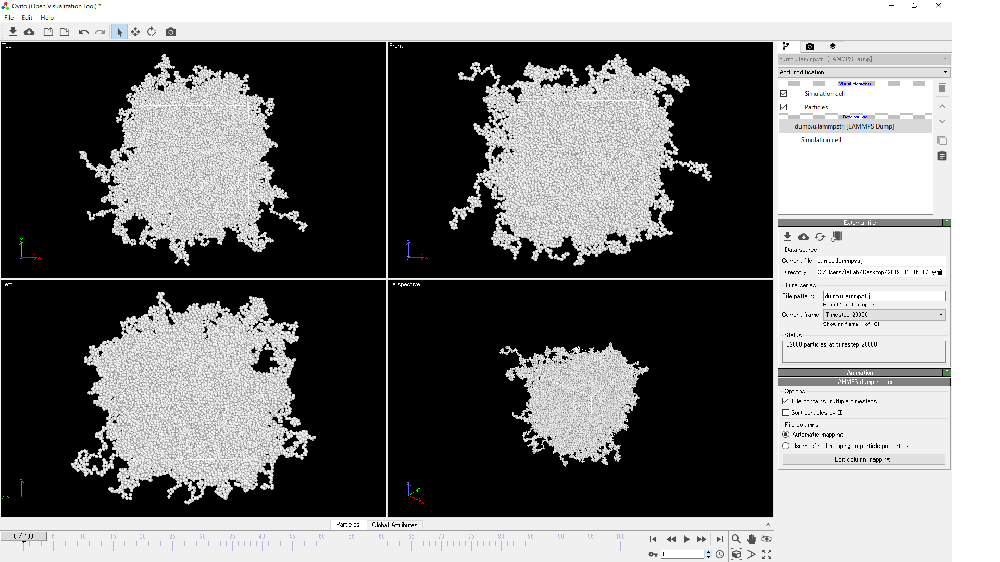
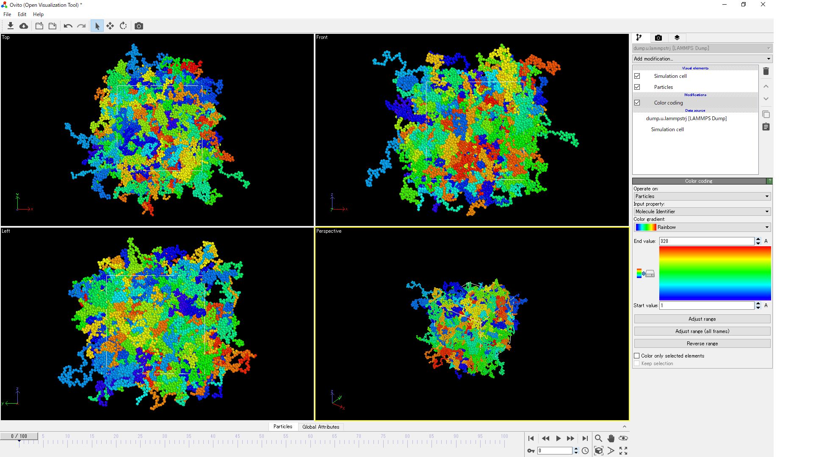
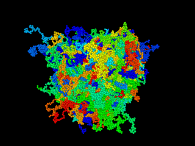

# トラジェクトリーデータの出力&可視化 03dump

1. 分子のトラジェクトリーデータを出力(dump)する。
2. 出力したデータを使って、OVITO で動画を作る。

## 実行方法

```
mpirun -n N ./lmp_mpi < in.chain.dump
```

## dump の設定箇所

```
dump d1 all custom 100 dump.lammpstrj id mol x y z
dump d2 all custom 100 dump.u.lammpstrj id mol xu yu zu
```
`.lammpstrj`という拡張子を使うと可視化ソフトでLAMMPSのトラジェクトリーデータと認識される。

ここでは２種類の方法で出力している。

+ dump.lammpstrj 周期境界で折り返された座標
+ dump.u.lammpstrj 周期境界で折り返さない座標 

# OVITO

※こちらは瀬戸亮平さんに当日教わりました。瀬戸さんに感謝！

+ [OVITO](https://ovito.org/)

上記に行き、Ovitoをダウンロード(OVITO-3.0.0-dev322)＆インストール。

dump.lammpstrj or dump.u.lammpstrj を読み込んでみる。(下はdump.u.lammpstrj を読み込んだ例)



粒子のサイズが小さい場合は調整する

1. Particles をクリック
1. Default particle radius を 0.5 に変更

分子毎に色分けする。

1. Add modification → Color coding
1. Input property → Molecule Identifier
1. Adjust range



## 動画（gif アニメ）を作る

1. 右下のPerspective をクリックし、Preview Mode にする
1. Preview Mode は実際の動画と同じものになるので、大きさ、向きを調整する。
1. 右上のカメラマークをクリック、Render Active Viewportを開く。（左上のカメラマークをクリックすると動画作成が始まるので、その場合は一旦キャンセルする）
1. Complete animation にチェック
1. Save to file にチェック、Choose からgifを選択
1. 左上のカメラマークをクリックすると、動画作成が始まる。

## gif アニメ



