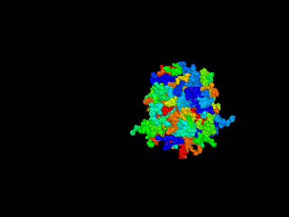
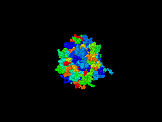

# せん断変形、伸長変形の方法 04deform
1. せん断変形、伸長変形を行う
1. 圧力テンソル（応力テンソルに負符号つけたもの）をvariableで定義し、fix ave/time でファイル出力
1. トラジェクトリーデータを可視化

## せん断変形
 
```
mpirun -n N ./lmp_mpi < in.chain.shear
```



**(注)** 変形を強調するためせん断速度が大きな値を使っています。

## 一軸伸長変形

```
mpirun -n N ./lmp_mpi < in.chain.uni
```

