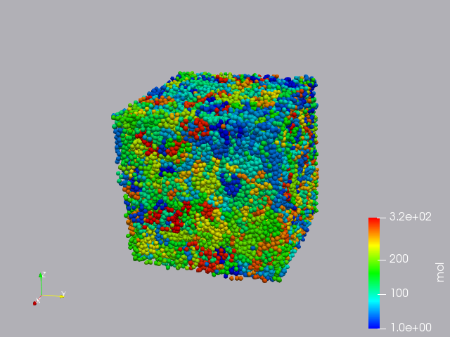

# Paraview による可視化 07vtk

## 内容

1. cmake のインストール
1. VTK のインストール
1. USER-VTK のインストール
1. Paraviewで可視化

## cmake のインストール

最新版のソースをダウンロード。

+ [cmake のダウンロードページ](https://cmake.org/download/)

インストール。

```
tar zxvf cmake-${version}.tar.gz
cd cmake-${version}
./configure --prefix=$HOME
make
make install
```
**(注)** cmake は`$HOME/bin`  にインストールされます。


## VTK のインストール

最新版のソースをダウンロード。

+ [VTK のダウンロードページ](https://vtk.org/download/)

インストール。

```
tar zxvf VTK-${version}.tar.gz
cd VTK-${version}
mkdir build
cd build
$HOME/bin/cmake ..
make
su
# make install
```
**(注)** VTK は `/usr/local` 以下にインストールされます。

## USER-VTK のインストール

cmake を使ってインストールする。Makefileを書き換えるのはVTK のところが、結構大変だったので cmake でインストールしてみたら、すぐできた、というのが本音。

```
cd lammps-${version}
mkdir build
cd build
$HOME/bin/cmake ../cmake -DPKG_MOLECULE=yes -DPKG_USER-VTK=yes
make
```

これで、`lammps-${version}/build/.` に `lmp` ができる。

**(注1)**　ここでは`MOLECULE`と`USER-VTK`しかインストールしていないので他のパッケージは有効にならない。必要なパッケージは `-DPKG_HOGEHOGE=yes` で指定する。

**(注2)** `lammps-${version}/src` で `make` した状態の場合は `cmake` がこける。エラーメッセージの通りにコマンド実行を行うと`src` 以下が綺麗になり、`cmake` が実行できるようになる。よくわからない場合は新しくLAMMPSのソースを取ってきてから
```
tar xvf lammps-${version}.tar.gz
cd lammps-${version}
mkdir build
cd build
cmake ../cmake -DPKG_MOLECULE=yes -DPKG_USER-VTK
```
とするとよい。


## Paraviewによる可視化

実際に、`lammps-${version}/bench` の `in.chain` を書き換えて、vtk ファイルを出力してみる。

`run 100` の前に以下を追加。
```
dump vtk1 all vtk 10 dump.*.vtk id mol type x y z vx vy vz fx fy fz
```

LAMMPSの実行

```
mpirun ./lmp -in in.chain
```

Paraview で vtk ファイルを開き、以下のように設定する。
```
Representation -> 3D Glyphs
Coloring -> mol
Glyph Type -> Sphere
```

色の設定を `Blue to Red Rainbow` にすると、下のような絵がかける。

